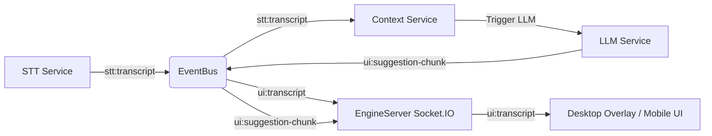

# Ghost AI — Architecture & System Specification

## 1. System Topology

Ghost AI uses a modular monorepo structure designed for high speed, minimal latency, and extreme operational stealth.

```
Ghost AI Monorepo
├── apps/
│   ├── core-engine/       # Node.js backend (Port 3001)
│   │   ├── src/
│   │   │   ├── audio/     # PCM audio pipeline & SoX capture
│   │   │   ├── context/   # Rolling circular context ring
│   │   │   ├── llm/       # Gemini 3.5 LLM streaming & vision
│   │   │   ├── monitor/   # Non-blocking screen share detector
│   │   │   ├── stt/       # Gemini & Whisper STT service
│   │   │   ├── utils/     # EventBus & Logger
│   │   │   ├── index.ts   # Entrypoint & event routing
│   │   │   └── server.ts  # Express + Socket.IO server
│   │   └── public/spy/    # Compiled static Spy Web assets
│   │
│   ├── desktop/           # Electron desktop overlay
│   │   ├── src/
│   │   │   ├── main.js    # Main process & stealth protections
│   │   │   └── preload.js # Electron IPC bridge
│   │   └── renderer/      # Vanilla JS overlay UI
│   │
│   └── spy-web/           # React + Vite mobile spy web app
│       ├── public/        # AudioWorklet processor module
│       └── src/           # React component tree
│
└── docs/                  # Architecture & Design documentation
```

---

## 2. Event Routing Architecture

The `EventBus` (`apps/core-engine/src/utils/EventBus.ts`) serves as the internal pub/sub event spine.



---

## 3. Stealth Protections & Anti-Detection Matrix

| Protection Layer | Technical Implementation | Defense Target |
|------------------|--------------------------|----------------|
| **Black Box Window Shield** | `mainWindow.setContentProtection(true)` | Prevents screen-recording tools (Zoom, Meet, Teams) from capturing overlay UI |
| **Headless Remote Mode** | `pnpm dev -- --headless` | Eliminates desktop GUI entirely; teleprompter runs on mobile browser over Wi-Fi |
| **Process Name Masking** | Dynamic binary copy (`msedge_security_broker.exe`) | Defeats process scanners looking for `electron.exe` or `node.exe` |
| **Click-Through Mode** | `mainWindow.setIgnoreMouseEvents(true)` | Allows mouse clicks to pass straight to background interview applications |
