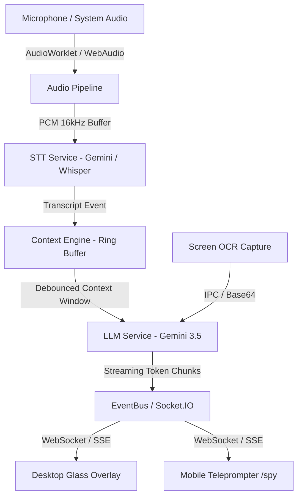
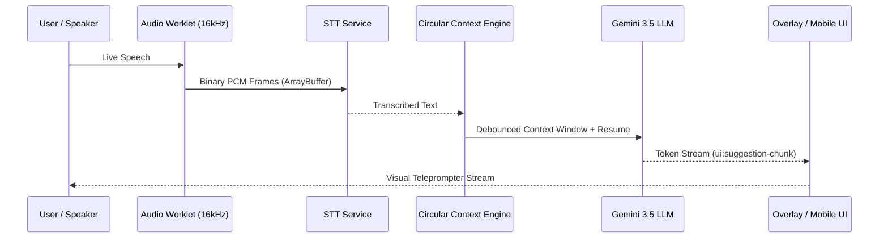

# Ghost AI — High Level Design (HLD)

## 1. System Overview

**Ghost AI** is an ultra-low latency, real-time invisible AI assistant designed for live technical interviews, high-stakes meetings, pair programming, and automated OCR code solving. It operates with sub-20ms audio-to-text pipeline overhead, streaming AI teleprompter responses directly to an Electron glass overlay or a mobile web interface (`/spy`).

---

## 2. Core Architectural Pillars

### 2.1 Decoupled Micro-Services Core
The architecture is structured as a monorepo containing three primary packages:
- **`apps/core-engine`**: Node.js microservice running HTTP, SSE, Socket.IO, Audio Pipeline, STT, LLM Orchestration, and System Monitoring.
- **`apps/desktop`**: Electron framework overlay providing stealth glass rendering, OS shortcut management, process masking, and desktop capturer integration.
- **`apps/spy-web`**: React + Vite web app serving Mobile Spy Mode for remote teleprompter view without local GUI footprint.

### 2.2 Dual Interface Operation (Stealth & Desktop)
- **Desktop Overlay Mode**: Rendered as a frameless, transparent, click-through window with `setContentProtection(true)` to shield UI content from screen-sharing tools (Google Meet, Zoom, Teams, Webex).
- **Headless Mobile Spy Mode**: Deactivates desktop GUI completely, serving the teleprompter interface to a mobile device over local Wi-Fi (`/spy`), leaving zero process footprint on the host computer.

---

## 3. High-Level Data Flow

---

## 4. Key Subsystems & Responsibilities

| Subsystem | Primary Function | Key Design Guarantee |
|-----------|------------------|----------------------|
| **Audio Pipeline** | Captures mic / loopback audio via WebAudio / SoX | Zero-alloc TypedArray ring buffers |
| **STT Service** | Converts PCM audio to text via Gemini 3.5 Flash / Whisper | Silence gating + 44-byte static header |
| **Context Service** | Manages rolling transcript & session history | $O(1)$ push/read, $O(K)$ array joins |
| **LLM Service** | Streams structured candidate answers in 1st person | Model instance caching + AbortController |
| **System Monitor** | Detects active screen share applications | Non-blocking process lock (5s interval) |
| **Engine Server** | Serves Socket.IO, SSE, and static spy assets | `perMessageDeflate: false`, zero-copy WS |
