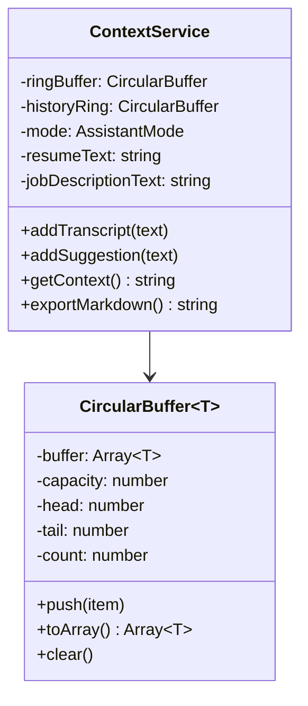

# Ghost AI — Low Level Design (LLD)

## 1. Class & Component Design

### 1.1 `ContextService` (`apps/core-engine/src/context/ContextService.ts`)
Manages in-memory rolling context buffers with zero-copy array operations and string interning.

```typescript
export type AssistantMode = 'interview' | 'meeting' | 'coding' | 'general';

interface TranscriptEntry {
  text: string;
  timestamp: number;
}

export class ContextService {
  private ringBuffer: CircularBuffer<TranscriptEntry>;
  private historyRing: CircularBuffer<HistoryEntry>;
  private mode: AssistantMode;
  private resumeText: string;
  private jobDescriptionText: string;

  public addTranscript(text: string): void;
  public getContext(): string; // O(K) array join
  public getContextStructured(): StructuredContext;
  public exportMarkdown(): string; // O(N) array push join
  public exportJSON(): string;
}
```



---

### 1.2 `AudioPipeline` (`apps/core-engine/src/audio/AudioPipeline.ts`)
Manages hardware & OS audio capture streams, outputting aligned 16kHz 16-bit mono PCM chunks.

```typescript
export class AudioPipeline extends EventEmitter {
  private recording: boolean;
  private soxProcess: ChildProcess | null;
  private bufferList: Buffer[];
  private bufferTotalLen: number;

  public start(): void;
  public stop(): void;
  private startWithSox(): void;
}
```

---

### 1.3 `STTService` (`apps/core-engine/src/stt/STTService.ts`)
Performs speech-to-text transcription with silence gating and model caching.

```typescript
export class STTService {
  private provider: STTProvider;
  private genAI: GoogleGenerativeAI | null;
  private geminiModel: any;

  public transcribe(audioChunk: Buffer): Promise<string | null>;
  private transcribeWithGemini(audioChunk: Buffer): Promise<string | null>;
  private pcmToWav(pcmBuffer: Buffer): Buffer; // Buffer.allocUnsafe
}
```

---

### 1.4 `LLMService` (`apps/core-engine/src/llm/LLMService.ts`)
Orchestrates Gemini 3.5 streaming completions, vision analysis, prompt caching, and token microtask queueing.

```typescript
export class LLMService {
  private genAI: GoogleGenerativeAI | null;
  private modelCache: Map<string, any>;
  private modelName: string;

  public getSuggestion(context: string, mode: AssistantMode, resume?: string, jobDescription?: string, onToken?: (t: string) => void): Promise<string | null>;
  public analyzeImage(base64Data: string, mode: AssistantMode): Promise<string | null>;
  private getCachedModel(modelName: string, systemInstruction?: string): any;
}
```

---

## 2. Memory Management Specifications

### 2.1 Heap Budget Constraints
- **Core Engine Heap Cap**: $< 120\text{MB}$ sustained RAM during 60-minute session.
- **Desktop Electron Main Process**: $< 90\text{MB}$ sustained RAM.
- **Web Renderer Process**: $< 45\text{MB}$ V8 heap footprint.

### 2.2 Buffer Allocation Policies
1. **Audio ArrayBuffers**: Re-used TypedArrays (`Int16Array` 4096 samples).
2. **String Allocations**: Prompts and Markdown exports assembled via `Array.prototype.join()` to eliminate intermediate immutable string overhead.
3. **Image Payloads**: Base64 strings explicitly dereferenced (`base64Data = null`) immediately following Gemini API dispatch.
